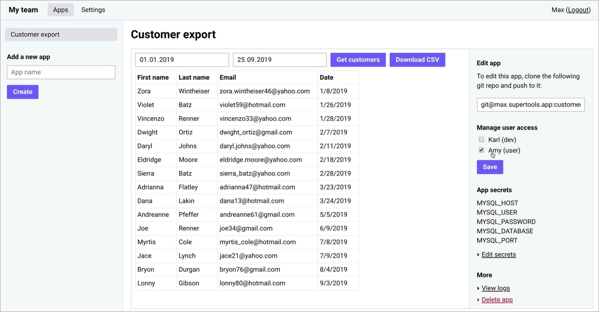

<p align="center">
  
    <br>
    A server for hosting your internal Node.js apps privately for your team mates.
</p>

<hr>

<p align="center">
  
</p>

## Features

-   All your internal apps on one server
-   Access control via web interface (no code required)
-   Sign-in with Slack
-   Deploy apps with git push
-   Built-in environment variables management
-   Support for private npm modules

## Installation

Please view the docs for easy installation instructions: https://supertools.app/docs

## Running Supertools locally

### 1. Add a local DNS config to enable local subdomains

For Supertools to work correctly for development, it must receive requests for the `supertools.test` domain (and its subdomains `*.supertools.test`).

This can be easily accomplished with the tools dnsmasq and Caddy.

On macOS, you can follow this tutorial on [local subdomains with Dnsmasq and Caddy](https://maximilianschmitt.me/posts/local-subdomains-dnsmasq-caddy/).

Then, use the following Caddy configuration to route all requests to `supertools.test` and `*.supertools.test` to `localhost:3333`:

```
http://supertools.test, http://*.supertools.test {
  proxy / http://localhost:3333
}
```

Once that is configured, running Supertools locally is like running any Node.js app.

### 2. Install and run Supertools

```
$ git clone git@github.com:maximilianschmitt/supertools.git
$ cd supertools
$ yarn
$ cp .example.env .env
$ yarn dev
```

Now you can access the Supertools web interface in your browser: http://supertools.test

To see running app processes, run:

```
$ yarn pm2 ls
```

_⚠️ Be aware that the development version of Supertools does not configure Gitolite, so pushing to your local Supertools repositories is not protected by access control._

## Contributing

Contributions are welcome and appreciated.

## License

MIT
